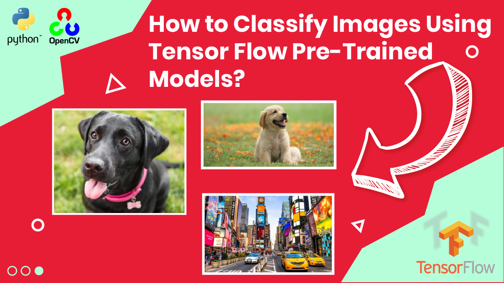

# TensorFlow Image Classification Tutorial: ResNet50 vs. MobileNet

  

##
   

Discover how to classify objects using pre-trained models
   
Welcome to our YouTube tutorial on Image Classification using Python, TensorFlow, and Keras with Convolutional Neural Networks (CNNs). 

🎥 What's Covered in the Video:

- Building the classification pipeline with TensorFlow and Keras for seamless implementation.
Leveraging the Keras application library to load powerful pre-trained models like ResNet50 and MobileNet.

- Preparing your own fresh images for classification, ensuring they fit the model's requirements and converting them into batches using the Numpy expand_dims function.

- Running predictions on the pre-trained models for your input images to see them in action.

👍 Don't forget to like this video if you find it helpful and subscribe to our channel to stay updated with the latest tutorials on AI, Machine Learning, and Computer Vision.

   
It is based on Tensorflow and keras.

You can find the link for the [tutorial](https://eranfeit.net/tensorflow-image-classification-tutorial-resnet50-vs-mobilenet/) here.  
You can find the link for the [Video tutorial](https://youtu.be/40_NC2Ahs_8) here. 
 
You can find more cool Tensorflow projects and tutorials in this [playlist](https://youtube.com/playlist?list=PLdkryDe59y4Ze9_12JhWu3cs-lOGYwYeD)

Enjoy

Eran
   

# Recommended courses and relevant products 

🚀 Want to get started with Computer Vision or take your skills to the next level ? 

If you’re just beginning, I recommend this step-by-step course designed to introduce you to the foundations of Computer Vision - [Complete Computer Vision Bootcamp With PyTorch & TensorFlow](https://trk.udemy.com/9LoE7E) 

If you’re already experienced and looking for more advanced techniques, check out this deep-dive course - [Modern Computer Vision GPT, PyTorch, Keras, OpenCV4](https://trk.udemy.com/EEDyMD)

Before we continue , I actually recommend this [book](https://amzn.to/3STWZ2N) for deep learning based on Tensorflow and Keras : 

# Connect

If you have any suggestions about papers, feel free to mail me :)

- [☕ Buy me a coffee](https://ko-fi.com/eranfeit)
- [▶️ Youtube.com/@eranfeit](youtube.com/@eranfeit?sub_confirmation=1)
- [🐙 Facebookl](https://www.facebook.com/groups/3080601358933585)
- [🖥️ Email](mailto:feitgemel@gmail.com)
- [🐦 Twitter](https://twitter.com/eran_feit )
- [😸 GitHub](https://github.com/feitgemel)
- [📸 Instagram](https://www.instagram.com/eran_feit/)
- [🤝 Fiverr ](https://www.fiverr.com/s/mB3Pbb)
- [📝 Medium ](https://medium.com/@feitgemel)

